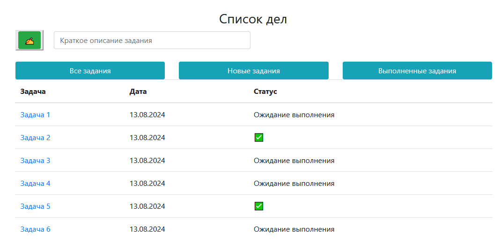
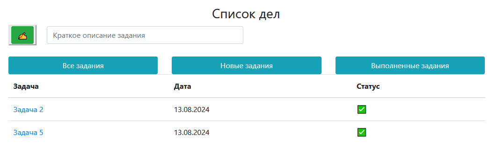
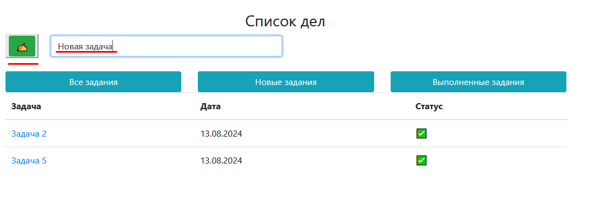
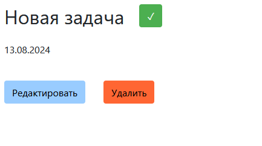
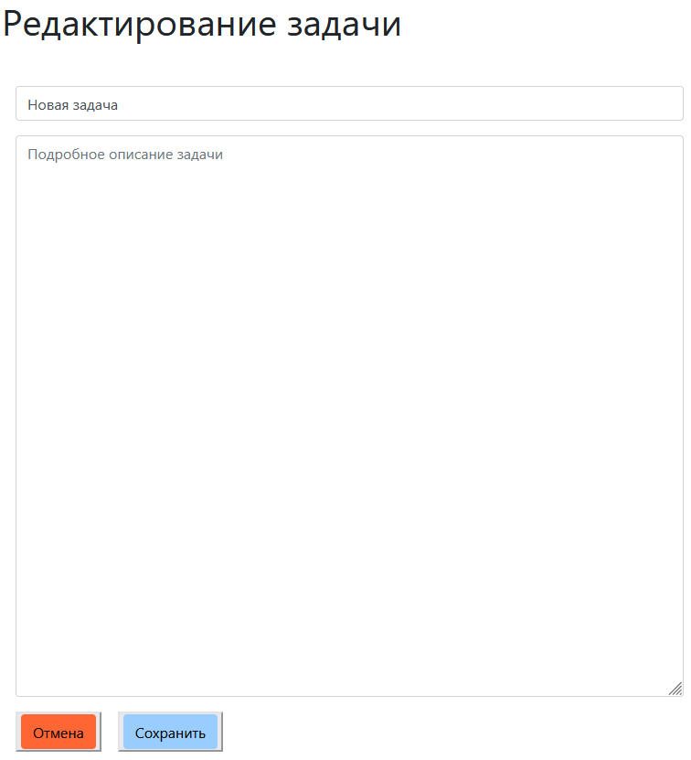
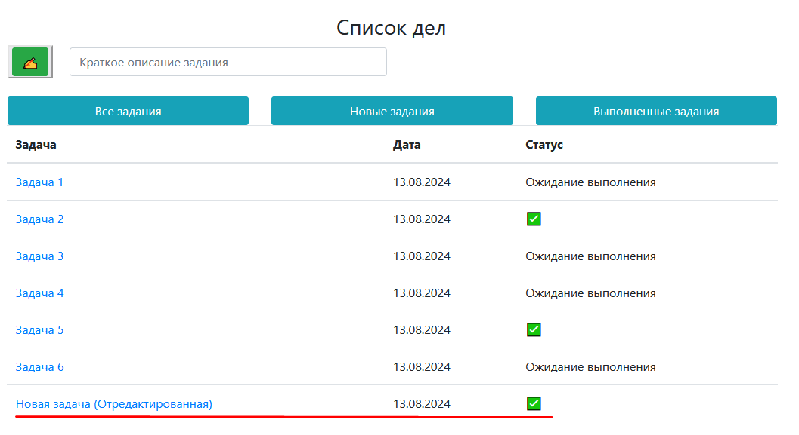

# job4j_todo
# Приложение Список дел

Простое приложение для управления списком дел, созданное с использованием фреймворка Spring. Это приложение позволяет пользователям добавлять, редактировать, удалять задачи и отмечать их как выполненные.

## Содержание

- [Особенности](#особенности)
- [Технологии](#технологии)
- [Использование](#использование)
- [Интерфейс(Скриншоты)](#Интерфейс)

## Особенности

- Добавление новых задач в список дел.
- Редактирование существующих задач.
- Удаление задач из списка.
- Отметка задач как выполненных или ожидающих выполнения.
- Фильтрация списка всех задач, выполненных и ожидающих выполнения.
- Адаптивный интерфейс с использованием Bootstrap.

## Технологии

- **Java 17**
- **Spring Boot 2.7.6**
- **Thymeleaf**
- **Bootstrap 5**
- **PostgreSQL**
- **Hibernate 5.6.11**
- **Maven** (для управления зависимостями)

## Установка и запуск

### Предварительные требования
- Установленный [Java 17](https://adoptium.net/)
- Установленный [Maven](https://maven.apache.org/)

### Сборка и запуск проекта

1. **Клонируйте репозиторий**:
   ```bash
   git clone https://github.com/yourusername/todo-app.git
   cd todo-app
2. ** Соберите проект с помощью Maven:
   ```bash
    mvn clean install
3. Запустите приложение:
   ```bash
   mvn spring-boot:run
4. Откройте приложение в браузере:
   Перейдите по адресу http://localhost:8080 для доступа к веб-интерфейсу приложения.

## Использование

После запуска приложения вы можете использовать веб-интерфейс для управления задачами. Добавляйте новые задачи, редактируйте или удаляйте существующие, отмечайте их как выполненные.

## Интерфейс (Скриншоты)

- Страница с задачами:

- Задачи можно отфильтровать, например, отображать только выполненные:

- Для создания новой задачи, нужно ввести в поле её краткое описание и нажать на кнопку "Создать":

- Затем выбрать её из списка и перейти на ее страницу:

- Если необходимо отредактировать задачу или описать ее подробно, можно нажать на соответствующую кнопку "Редактировать":

- Когда задача будет выполнена, необходимо нажать на кнопку с галочкой и пометить её как "Выполненная":

- Для удаления необходимо нажать на странице задание на кнопку "Удалить". Задачи можно удалять с любым статусом.